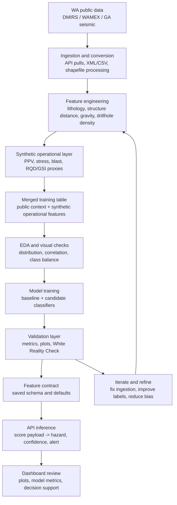
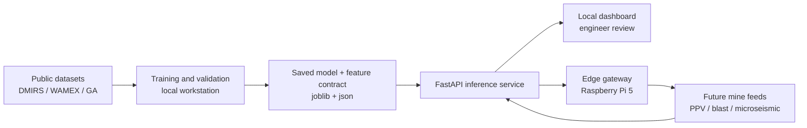
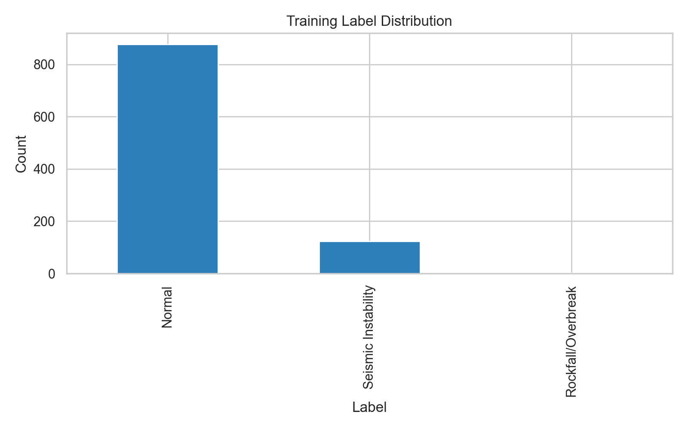
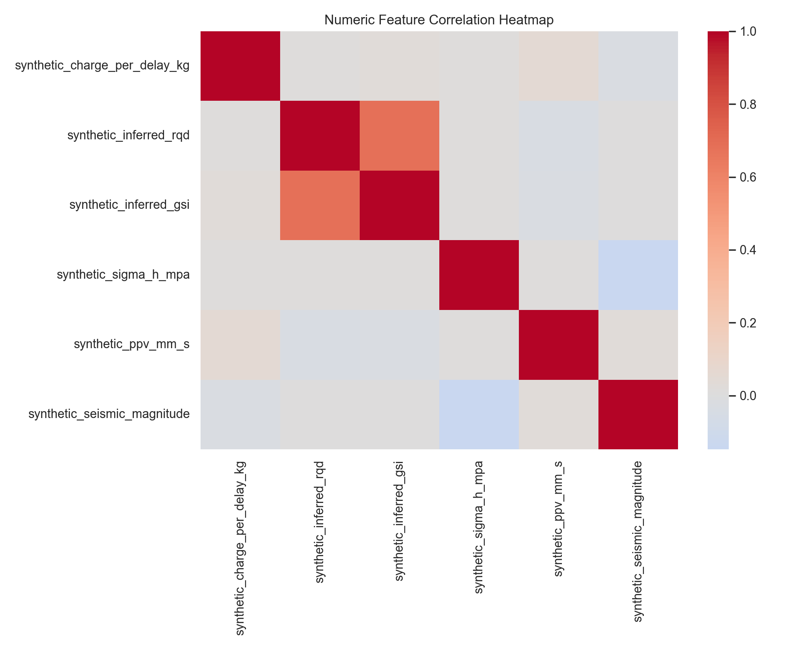
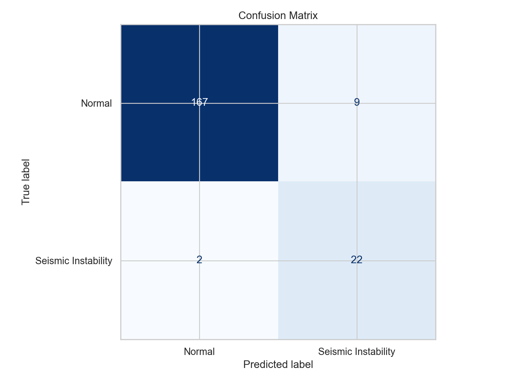
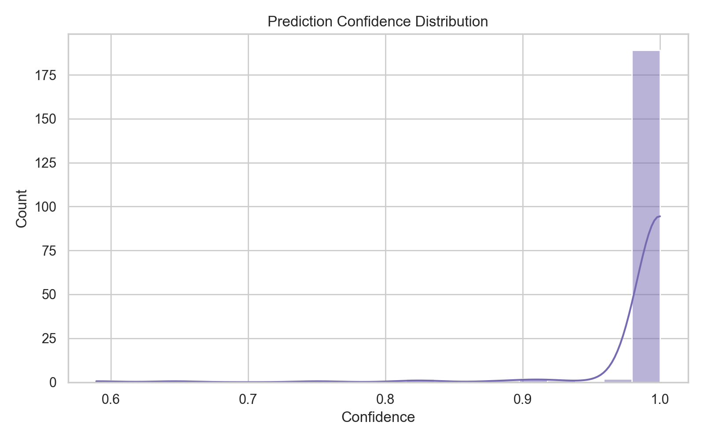

# mining-risk-intelligence


> "Context is not just the single prompt users send to an LLM. Context is the complete information payload provided to a model at inference time."  
> Adapted to this project: geology, structures, seismicity, blast response, rock quality, memory, and control logic must be treated as one operating system for decision support.

Geotechnical edge-AI for underground mining risk screening in **Laverton, Western Australia**, with focus on the **Granny Smith** and **Wallaby** structural corridors.

This repository is a **world-class prototype workflow**, not a mine-grade validated system. It combines:
- WA public geoscience data
- WAMEX-oriented lithology and drillhole preprocessing
- synthetic operational proxies where mine data is unavailable
- tabular ML training and validation
- dashboard and API delivery for edge-style review

---

## Why This Repo Exists

Most mining AI demos stop at one of three places:
- a notebook with no deployment path
- a dashboard with no real preprocessing discipline
- a model with no geotechnical context

This project does the harder thing:

It treats mining ML as a **context-engineering problem**.

That means the model is not fed only one table. It is fed a structured system of:
- geology
- structures
- gravity
- drillholes
- regional seismicity
- synthetic PPV / stress / blast proxies
- rules
- validation logic
- edge delivery constraints

The result is a repo that is useful for:
- recruiters evaluating technical depth
- mining engineers reviewing prototype decision support
- ML practitioners wanting a realistic geoscience-to-inference pipeline
- future extension to Raspberry Pi 5 edge deployment

---

## Why Use It

Use this project if you want to:
- build a mining-focused ML prototype from public geoscience data
- clean messy WAMEX lithology tables into model-ready features
- test geotechnical feature engineering before mine-site access is available
- demonstrate an end-to-end workflow from ingestion to dashboard to API
- show a practical edge-AI story instead of only a model screenshot

Use it when:
- you need a Laverton-focused concept demonstrator
- you want a recruiter-facing mining AI portfolio project
- you need a structured base before plugging in real mine PPV, blast, or seismic feeds
- you want to compare baseline and stronger models with an anti-overfitting check

---

## Core Idea

> Prompt engineering is what you say.  
> Context engineering is everything the model sees.  
> This repo applies that idea to geotechnical intelligence.

In this repository, the context system is:

```text
C = {
  lithology,
  RQD / rock quality proxies,
  structural proximity,
  gravity context,
  drillhole evidence,
  regional seismicity,
  blast / PPV proxies,
  ML outputs,
  validation checks,
  edge deployment constraints
}
```

That makes this more than a model repo. It is a **context-aware mining risk workflow**.

---

## ML Pipeline Flow



This cycle is the operating loop of the project:
- ingest context
- build features
- validate the model
- lock the feature contract
- deliver inference
- refine the system

---

## Deployment Flow



This deployment view shows how the current prototype can move from desktop validation toward edge-style decision support.

---

## Demo

- Dashboard: `http://127.0.0.1:8000/dashboard`
- API Docs: `http://127.0.0.1:8000/docs`
- Video Walkthrough: [Watch the 90-second demo](https://github.com/jeevanreddy23/mining-risk-intelligence/releases/download/v1.0/mining-risk-intelligence-demo.mp4)
- GitHub Repo: [jeevanreddy23/mining-risk-intelligence](https://github.com/jeevanreddy23/mining-risk-intelligence)

---

## Visual Results

These figures summarize the current Laverton prototype using WA public context data plus synthetic operational proxies.

### Pre-training
**Label distribution**



**Feature correlation heatmap**



### Post-training
**Confusion matrix**



**Prediction confidence distribution**



---

## Results Summary

Current validated prototype outputs:
- selected model: `hist_gradient_boosting`
- accuracy: `0.945`
- weighted F1: `0.948`
- macro F1: `0.884`
- White Reality Check p-value: `0.038`

Interpretation:
- the selected model currently outperforms the baseline after adjustment for model-selection bias
- this reduces prototype overfitting risk, but does **not** replace site validation

---

## Benefits

- uses real WA public datasets for regional context
- adds synthetic operational proxies only where mine data is unavailable
- produces ML-ready tables from messy drilling and lithology inputs
- includes training, visual checks, API inference, and dashboard review
- keeps public context separate from synthetic/private operational features
- is designed to later swap synthetic fields for real mine monitoring data

---

## Repo Structure

```text
mining-risk-intelligence/
  context.json
  configs/
    request.json
  data/
    raw/
      public/
      seismic/
      examples/
    README.md
  docs/
    RECRUITER_DEMO_SCRIPT.md
    RESEARCH_BACKED_ML.md
    SOURCES_AND_CITATIONS.md
  outputs/
    plots/
    white_reality_check/
  scripts/
    clean_wamex_lithology.py
    feature_engineering.py
    ga_xml_to_csv.py
    gravity_sampling.py
    merge_training_data.py
    sarig_to_csv.py
    synthetic_operational_data.py
    train.py
    visualize_pipeline.py
    wa_api_ingest.py
    white_reality_check.py
  src/
    app/
      context_loader.py
      main.py
      inference.py
      training.py
      schemas.py
      ...
  README.md
  requirements.txt
```

---

## Data Used

### Public datasets
- `DMIRS-015` State Linear Structures
- `DMIRS-038` Interpreted Bedrock Geology 1:100k
- `DMIRS-070` Gravity 400 m of WA
- `DMIRS-046` Mineral Exploration Drillholes
- `MINEDEX`
- `WAMEX`
- `Geoscience Australia` earthquake catalogue / XML records

### Public services and APIs
- DMIRS / SLIP ArcGIS REST services for structures, geology, and gravity
- GeoVIEW WA and WA Data Catalogue
- Geoscience Australia earthquake records

### Prototype-only synthetic fields
- `synthetic_ppv_mm_s`
- `synthetic_charge_per_delay_kg`
- `synthetic_dominant_frequency_hz`
- `synthetic_inferred_rqd`
- `synthetic_inferred_gsi`
- `synthetic_sigma_v_mpa`
- `synthetic_sigma_h_mpa`
- `synthetic_seismic_magnitude`
- `synthetic_seismic_depth_m`
- `target_label`

---

## WAMEX Lithology Pipeline

The repo includes a production-style preprocessing script for messy WAMEX lithology CSV/XLSX files:

- [scripts/clean_wamex_lithology.py](scripts/clean_wamex_lithology.py)

It:
- auto-detects common lithology / drillhole column names
- infers lithology groups and stiffness classes
- encodes RQD using AS 1726-style categories
- computes interval thickness and midpoint depth
- preserves coordinates and drillhole IDs when available
- flags structural risk when distance-to-fault or structure is below threshold
- creates missingness indicators
- outputs XGBoost-ready numeric tables
- marks proxy labels clearly when targets are synthetic

CLI example:

```bash
python scripts/clean_wamex_lithology.py --input data/raw_wamex --output data/processed
```

Outputs:
- `cleaned_lithology_features.csv`
- `xgboost_training_table.csv`
- `feature_dictionary.json`
- `preprocessing_report.md`
- `preprocess_pipeline.joblib`

---

## Context Layer

This repo includes a lightweight context-engineering layer:
- [context.json](context.json)
- [src/app/context_loader.py](src/app/context_loader.py)

It defines:
- project purpose
- Laverton scope
- focus corridors
- data sources
- feature groups
- model stack
- rule overrides
- validation logic
- deployment constraints

That makes the repo easier to extend, easier to explain, and more reusable than a single notebook workflow.

---

## Model Stack

Current repo models:
- Logistic Regression baseline
- Random Forest
- HistGradientBoostingClassifier

Target future models:
- XGBoost Classifier
- HMM regime detection

Model selection currently uses `macro_f1` to avoid over-favoring the majority label.

---

## Validation Layer

This repo includes several validation stages:
- train/test metrics
- data and prediction visuals
- White Reality Check

White Reality Check script:
- [scripts/white_reality_check.py](scripts/white_reality_check.py)

Saved outputs:
- `outputs/white_reality_check/white_reality_check.json`
- `outputs/white_reality_check/white_reality_check_fold_metrics.csv`
- `outputs/white_reality_check/white_reality_check_report.md`

This is especially important because the prototype still uses synthetic labels and synthetic operational fields.

---

## API

### `GET /health`
Returns service health.

### `GET /dashboard`
Returns the local dashboard UI for metrics, validation, and visual review.

### `POST /score`
Consumes merged-table style features and returns:
- `Hazard Type`
- `Risk Score`
- `Alert Level`
- `Failure Mechanism`
- `Confidence Level`
- `Class Probabilities`
- `Top Drivers`

---

## Quick Start

### 1. Install dependencies
```bash
pip install -r requirements.txt
```

### 2. Build the prototype pipeline
```bash
python scripts/synthetic_operational_data.py --output data/synthetic_operational_data.csv --rows 5000
python scripts/merge_training_data.py --public-features data/geology_features_with_gravity.csv --synthetic-operational data/synthetic_operational_data.csv --seismic data/regional_seismic_events.csv --output data/final_training_table.csv
python scripts/train.py
```

### 3. Generate visuals
```bash
python scripts/visualize_pipeline.py --training-table data/final_training_table.csv --predictions data/test_predictions.csv --feature-importance data/feature_importance.csv --output-dir outputs/plots
```

### 4. Run the local dashboard and API
```bash
uvicorn src.app.main:app --reload
```

---

## Product Principles

To make a repo people actually return to, it must do more than “work.”

This repo is designed around product-stickiness principles:
- **Trigger:** clear GitHub landing page, dashboard, demo link, and visuals
- **Action:** one understandable path from raw data to model to API
- **Reward:** visible outputs, plots, metrics, and hazard scoring
- **Investment:** reusable scripts, context.json, validation outputs, and recruiter demo assets

That makes the project easier to explore, easier to trust, and easier to extend.

---

## Important Note

This is a prototype decision-support workflow.

Public datasets provide the **regional context layer**. Several mine-operational fields are still simulated as proxies. Results should **not** be treated as mine-grade validated outputs until real site monitoring, blast, and geotechnical data are integrated.

---

## References

Selected references used in this project:

- Breiman, L. (2001). *Random Forests*. Machine Learning, 45, 5-32.
- Friedman, J.H. (2001). *Greedy Function Approximation: A Gradient Boosting Machine*. Annals of Statistics, 29(5), 1189-1232.
- Bieniawski, Z.T. (1989). *Engineering Rock Mass Classifications*. Wiley.
- Hoek, E., Marinos, P., and Benissi, M. (1998). Applicability of the Geological Strength Index (GSI) classification for very weak and sheared rock masses.
- Gutenberg, B., and Richter, C.F. (1944). Frequency of earthquakes in California.
- WA public data sources: DMIRS, GeoVIEW WA, WAMEX, Geoscience Australia.

Full source notes:
- [docs/SOURCES_AND_CITATIONS.md](docs/SOURCES_AND_CITATIONS.md)
- [docs/RESEARCH_BACKED_ML.md](docs/RESEARCH_BACKED_ML.md)
